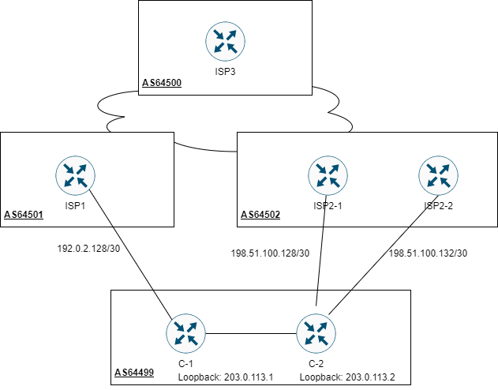

# Webinar-20.09.2022
Materiały do webinaru w ramach cyklu Władcy Sieci

# Topologia

# Narzędzia potrzebne każdemu adminowy pracujcemu z BGP 🧰
__(podobne narzędzia pojawiają się co jakiś czas w naszym [newsletterze](https://showroute.pl/netprasowka))__

https://lg.twelve99.net/ - looking glass operatora Tier 1 (taki który nie płaci za dostęp do Internetu). Mamy dostęp do prawie wszystkich węzłów sieci. Od Europy poprzez Azję aż do obu Ameryk. Cały Internet. 
https://lg.atman.pl/ - looking glass polskiego operatora usług biznesowych i data center. 
http://lg.tpnet.pl/ - looking glass naszego operatora krajowego. 
http://lg.netia.pl/ - looking glass drugiego naszego operatora krajowego. Oprócz looking glass jest też możliwość sprawdzenia przepustowości łącza poprzez pobranie pliku 10MB, 50MB, 100MB i 500MB. Przydaje się i jest w miarę wiarygodne, gdy masz usługę od Netia. 
http://lg.retn.net - looking glass przydatny do sprawdzania co się dzieje z naszymi prefiksami na terenie państw CIS/WNP. 
https://lg.he.net - looking glass od HE. Duża liczba PoP i wyniki pokazywane w formie surowej (bez tabelek i “ozdobników” graficznych) 

https://rpki-validator.ripe.net/ui/ - walidator od RIPE. Działa na oprogramowaniu Routinator, najpopularniejszy obecnie walidator w Internecie. 
https://rpki.cloudflare.com/ - walidator od Cloudflare. Oprócz samej opcji sprawdzenia ROA dostarcza również informacje statystyczne dotyczące RPKI i BGP. 
https://rpki-monitor.antd.nist.gov/ - walidator od NIST. Podobnie jak walidator od Cloudflare zawiera dane statystyczne, ale ma podział na operatorów i historię. 

https://redirector.googlevideo.com/report_mapping - z którego cacha Google właśnie korzystasz. Skąd Twoi klienci oglądają filmy z YouTube.  
http://whatismyip.akamai.com/advanced - z którego cacha sieci CDN Akamai właśnie korzystasz.  
https://bgp.he.net/ - narzędzie udostępniające informację o prefiksach i AS, które jest rogłaszają. 

# Hej to jeszcze nie koniec. Pozostańmy w kontakcie.  👋

Dołącz do newslettera Showroute.pl 
Co tydzień dostaniesz mail z 5 linkami wraz z krótkim opisem do treści, związanymi z siecią, ciekawych wpisów, narzędzi, ofert pracy, analizy bieżących wydarzeń w sieci.  

Zapisz się już teraz na https://showroute.pl/netprasowka/
